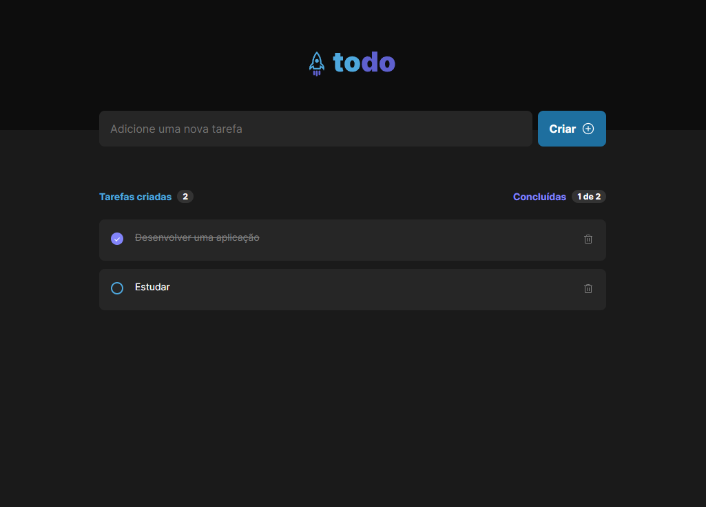

<h1 align="center"> Desafio 1 - Formação ReactJS </h1>

  ToDo List

  <a href="#-tecnologias">Tecnologias</a>&nbsp;&nbsp;&nbsp;|&nbsp;&nbsp;&nbsp;
  <a href="#-projeto">Projeto</a>&nbsp;&nbsp;&nbsp;|&nbsp;&nbsp;&nbsp;
  <a href="#-layout">Layout</a>&nbsp;&nbsp;&nbsp;|&nbsp;&nbsp;&nbsp;

 

  </a>

## 🚀 Tecnologias

Esse projeto foi desenvolvido com as seguintes tecnologias:

- HTML e CSS
- React + TypeScript
- Git e Github
- Vite

## 💻 Projeto

Nesse desafio, foi desenvolvido uma aplicação de controle de tarefas no estilo to-do list e foram aplicados os conceitos de:
- Estados
- Imutabilidade do estado
- Listas e chaves no ReactJS
- Propriedades
- Componentização

## 🔖 Layout

Você pode visualizar o layout do projeto através [DESSE LINK](https://www.figma.com/design/0n0zDN7zbzhRbaEO74Xesx/ToDo-List-%E2%80%A2-Desafio-React/duplicate?node-id=56-96). É necessário ter conta no [Figma](https://figma.com) para acessá-lo.

---

Feito por Vinícius Brunheroto :wave: (https://viniciusbrunheroto.github.io/linktree-pessoal/)
